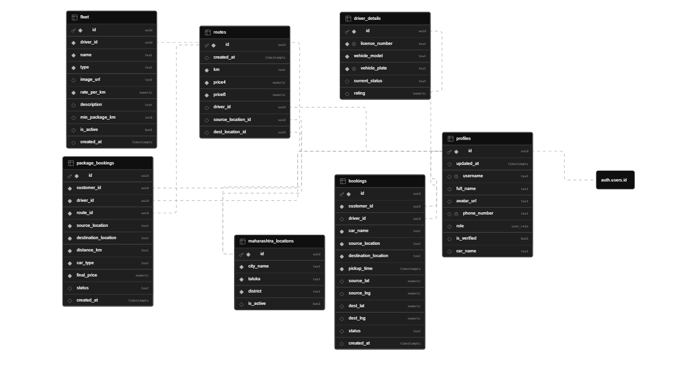

---

# Vantage Ride – Premium Vehicle Booking Platform

Vantage Ride is a web application designed for booking **luxury and vintage vehicles**.
It follows a **vehicle-based booking system**, allowing users to select specific vehicles instead of being assigned one randomly.

---

## Live Demo

Access the application:
[https://vantage-ride.vercel.app/](https://lnkd.in/dmHvQ6Hd)

---

## Overview

This platform provides a premium booking experience where:

* Users select a vehicle
* System verifies availability
* Booking is created instantly
* Driver/owner receives notification

It is suitable for **luxury rentals, events, and curated ride services**.

---

## Features

### Vehicle Booking

* Select specific vehicles
* Real-time availability check
* Simple and fast booking process

---

### Driver / Owner Capabilities

* Add and manage vehicles
* Publish service packages
* Define pricing, routes, and discounts
* Receive booking requests
* Update booking status:

  * Accept
  * Reject
  * Complete

---

### Booking Management

* Automatic booking creation
* Full booking lifecycle tracking
* Status-based ride handling

---

### Role-Based Access Control (RBAC)

**Customer**

* Browse vehicles
* Book rides
* View booking history

**Driver / Owner**

* Manage fleet and packages
* Handle ride requests
* View ride history

**Admin (In Progress)**

* Manage users and platform operations

---

## Notification System

The application includes a **web-based notification system**:

* Modules:

  * `notification-user`
  * `notification-driver`
* Triggered after booking actions
* Displayed directly in the UI
* Uses Supabase realtime updates
* No external push services required

---

## Tech Stack

Frontend:

* Angular
* TypeScript
* HTML
* CSS

Backend:

* Supabase (PostgreSQL, Authentication, Realtime)

Deployment:

* Vercel

---

## Project Structure

```
project-root/
│
├── public/
│   └── image/
│
├── src/
│   └── app/
│       └── components/
│           ├── home/
│           ├── book-ride/
│           ├── manage-fleet/
│           ├── my-rides/
│           ├── notification-user/
│           ├── notification-driver/
│           └── ...
│
├── supabase/
│   ├── schema/
│   └── queries/
│
└── README.md
```

---

## Screenshots

📸 Screenshots

.png)
.png)
.png)
.png)
.png)
.png)
.png)
.png)
.png)
.png)
---

## Database Schema

This diagram shows the core entities such as users, vehicles, bookings, packages, and notifications, along with their relationships.



---

## Backend

Supabase is used as the backend service:

* PostgreSQL database
* Authentication system
* Real-time updates
* Booking and notification handling

---

## Booking Workflow

1. Customer selects a vehicle
2. Booking is created in the system
3. Driver/owner receives notification
4. Driver updates booking status:

   * Accept / Reject
5. After ride completion:

   * Mark as Completed
6. Both customer and driver can view ride history

---

## Status

* Core features implemented
* Notification system working
* Booking workflow completed
* Admin module under development

---
## Android Application

A separate Android application has been developed for this platform using the same Supabase backend.

Features:
- Browse and book vehicles  
- User authentication  
- Booking management  
- Shared backend with web application  

Repository:
ANDROID_REPO_LINK
